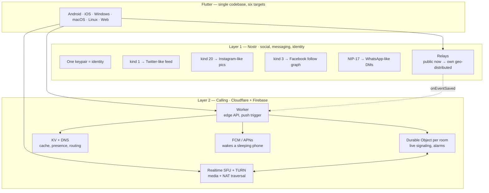

# Multi-platform social + calling app — build spec

A bundled Twitter + Facebook + Instagram + WhatsApp messaging + audio/video calling product, built on Nostr for the social/messaging layer and Cloudflare + Firebase for the calling layer. One Flutter codebase shipping to Android, iOS, Windows, macOS, Linux, and web.

This document is the architectural source of truth. Read it end to end before writing any code.

---

## TL;DR

- **One keypair, four UIs.** All social and messaging content lives on Nostr as typed events. The four "apps" are four views on the same event stream — kind 1 is a Twitter-like feed, kind 20 is Instagram-like pictures, kind 3 is the Facebook follow graph, NIP-17 gift-wrapped DMs are the WhatsApp-like chat.
- **MLS-encrypted messaging.** Private messages (1:1 and group chats) use MLS (RFC 9420) for content encryption — forward secrecy, post-compromise security, efficient group key rotation. NIP-17 gift-wrapping provides the transport metadata layer. Public posts are public; MLS covers messaging only.
- **Cloudflare runs the calls.** Cloudflare Realtime (SFU + TURN) handles media, a Worker is the edge API, a Durable Object per room runs signaling. FCM / APNs wakes sleeping phones.
- **Flutter everywhere.** Roughly 85% shared Dart code, 15% per-platform native (the calling shell on iOS and Android, desktop notification trays).
- **Own relays for speed.** Public Nostr relays for dev, geo-distributed self-hosted relays for prod. Self-hosted relays also double as the notification bridge to FCM.
- **No self-hosted databases.** Everything is either Nostr-relay-resident or in Cloudflare managed services (KV, D1, R2, Durable Objects).

---

## Vision

A self-custodial, censorship-resistant, multi-platform app that gives users the four social experiences they already know — micro-blogging, photo sharing, social graph with posts, and 1:1 / group chat with voice and video — without any of them living on a server we have to maintain or that an outside party can shut down. The protocol layer is open and federated. The calling layer is the only place we depend on managed infrastructure, and we picked Cloudflare because the economics are right and the free tier is generous.

Primary launch market: India. App is bilingual-ready (Hindi + English) from day one. Voice-first affordances for messaging where possible.

---

## Architecture overview

Two layers, clean separation.



### Call flow — hybrid P2P / SFU

**Decision: P2P for 1:1 calls, SFU for group calls.** The app knows at call creation time whether this is 1:1 or group. No mid-call migration in v1. If someone wants to add a third person to a 1:1 call, start a new group call.

All signaling uses **NIP-100** (kind 25050 events through Nostr relays). The only difference is where media flows.

**1:1 call (P2P) — callee is asleep:**

```
Caller publishes kind 25050 type:connect to own relay
  → relay onEventSaved hook → push Worker → FCM wakes callee
  → callee accepts, publishes kind 25050 type:connect back
  → caller sends kind 25050 type:offer (encrypted SDP) via relay
  → callee sends kind 25050 type:answer (encrypted SDP) via relay
  → both exchange kind 25050 type:candidate (ICE) via relay
  → media flows DIRECT peer-to-peer (or via TURN if NAT blocks)
  → zero SFU cost
```

**Group call (SFU) — 3+ participants:**

```
Initiator publishes kind 25050 type:connect with room tag "r"
  → relay onEventSaved hook → push Worker → FCM wakes all invitees
  → each participant accepts, connects WebSocket to Durable Object room
  → each participant exchanges SDP offer/answer with Cloudflare Realtime SFU (via DO)
  → ICE candidates exchanged via DO
  → media flows through SFU (one upload per participant, SFU fans out)
```

**Cost impact:** most calls are 1:1. P2P means zero media server cost for those. SFU egress ($0.05/GB) only applies to group calls. Estimated 70-80% media cost savings vs routing everything through SFU.

### Two hard walls to acknowledge

1. **Group video fan-out needs an SFU.** P2P mesh falls apart past 3 participants. Cloudflare Realtime is our SFU for group calls. 1:1 calls stay P2P (free). This is a managed dependency we accept only for group calls.
2. **Mobile wake is an OS chokepoint.** You cannot wake a sleeping phone without going through Google's FCM or Apple's APNs. There is no decentralized substitute. This is a managed dependency we accept.

Everything else can be self-hosted or protocol-native.

---

## Layer 1 — Nostr in detail

### Identity

Every user has a single Nostr keypair (32-byte secp256k1). The public key (npub) is their identity across all four "apps." There is no separate username on a server — the npub is the username.

NIP-05 ("nostr address") gives them a human-readable handle like `davy@yourdomain.com` that resolves to their npub. Run a simple `/.well-known/nostr.json` endpoint on a Cloudflare Worker to serve these.

### Event-kind mapping

| App view | Nostr event | Notes |
|---|---|---|
| Twitter-like feed | kind 1 (short text note) | NIP-01. Replies use NIP-10 thread tags. |
| Instagram-like pics | kind 20 (picture event) | NIP-68. Media URL points to your R2 bucket. |
| Facebook follow graph | kind 3 (follow list) | NIP-02. Single replaceable event per user. |
| Facebook-style posts | kind 1 with media | Same as Twitter view, just renderer differs. |
| WhatsApp-like DMs (1:1 and group) | NIP-17 (gift-wrapped, kinds 14/13/1059) | Outer layer: NIP-59 gift-wrap (hides metadata from relays). Inner layer: **MLS (RFC 9420)** for message content encryption — forward secrecy, post-compromise security, efficient group key rotation. NIP-44 is NOT used for message content. Never use legacy NIP-04. |
| Call signaling (invite, offer, answer, ICE) | kind 25050 (NIP-100 WebRTC) | type tag: connect/disconnect/offer/answer/candidate. Content encrypted NIP-44 (ephemeral signaling — MLS overhead not warranted). P2P for 1:1, SFU for group. |
| User profile (display name, bio, avatar) | kind 0 (metadata) | Replaceable. |
| Inbox relay list | kind 10050 | NIP-17 routing. Tells senders where to deliver your DMs. |
| Reactions | kind 7 | NIP-25. |
| Reposts | kind 6 | NIP-18. |
| Long-form posts | kind 30023 | NIP-23. Optional for Facebook-style longer posts. |

The four UIs are filters on the same event stream. The Twitter view subscribes to `{ kinds: [1, 6, 7], authors: [...follows] }`. The Instagram view subscribes to `{ kinds: [20], authors: [...follows] }`. The Facebook view shows kind 3 plus kind 1 with attached media plus kind 7 reactions. All four pull from the same set of relays. Build the Nostr client layer once, render four ways.

### NIPs to implement

Must-have for MVP:

- NIP-01 (basic protocol)
- NIP-02 (follow lists)
- NIP-04 — **do not use, deprecated**
- NIP-05 (DNS identifiers)
- NIP-10 (thread tags)
- NIP-17 (gift-wrapped DMs) — primary DM transport. Outer metadata protection. Inner content encrypted by MLS, not NIP-44.
- NIP-19 (bech32 encoding: npub, nsec, note, nevent, nprofile)
- NIP-25 (reactions)
- NIP-42 (relay AUTH) — needed for own relays that require auth
- NIP-44 (versioned encryption) — used ONLY for call signaling (kind 25050) and NIP-17 gift-wrap outer layer. NOT used for message content encryption (MLS handles that).
- NIP-49 (encrypted nsec backup) — for key recovery UX
- NIP-59 (gift wrap)
- NIP-65 (relay list metadata)
- NIP-68 (picture-first feeds) — for kind 20 / Instagram view
- NIP-100 (WebRTC signaling) — kind 25050 for call setup. P2P for 1:1, SFU for group. Study 0xchat's implementation in `packages/nostr-dart`.
- **MLS (RFC 9420)** — Messaging Layer Security for all private message content (1:1 DMs and group chats). Provides forward secrecy, post-compromise security, efficient group key rotation. Layered inside NIP-17 transport.

Nice-to-have post-MVP:

- NIP-18 (reposts)
- NIP-23 (long-form content)
- NIP-51 (lists — for mute, bookmarks, follow sets)
- NIP-57 (Lightning zaps) — if we want micropayments
- NIP-72 (moderated communities) — useful for spam control
- NIP-96 (HTTP file storage) — if we want Nostr-native blob hosting alongside R2

### Relay strategy

**Phase 1 (dev):** Connect to 3-5 well-trafficked public relays — `wss://relay.damus.io`, `wss://nos.lol`, `wss://relay.primal.net`, `wss://relay.nostr.band`. Verify the current top relays before hardcoding; the list shifts.

**Phase 2 (prod):** Deploy own relay using **Nosflare** (github.com/Spl0itable/nosflare) — a serverless Nostr relay running entirely on Cloudflare Workers + D1 + Durable Objects. No VPS to manage.

- D1 database stores events with global read replication via Session API (read replicas close to users worldwide)
- Durable Objects mesh across 9 regions handles WebSocket connections and real-time event broadcasting
- WebSocket Hibernation reduces billing during idle connections
- Built-in: pubkey allow/blocklist, event kind filtering, rate limiting, content blocking, NIP-05, anti-spam
- Supports NIPs 1, 2, 4, 5, 9, 11, 12, 15, 16, 17, 20, 22, 33, 40, 42 — NIP-17 (DMs) covered, NIP-100 (kind 25050) works via NIP-1
- MIT license, 95 stars, live relay at wss://relay.nosflare.com
- Total relay cost: Workers paid plan ($5/mo) + D1/DO usage. At low-to-moderate volume, significantly cheaper than 5 VPS boxes.

No geographic DNS routing needed — Cloudflare edge auto-distributes. A user in Mumbai hits a nearby Cloudflare PoP automatically.

**Walled vs federated:** Default to federated for public content, strict internal for private content. The app implements this as a routing table in the Nostr client layer:

**Own relays ONLY (private, fast, controlled):**
- NIP-17 DMs — gift-wrapped, encrypted, no reason for public relays to see these
- NIP-100 call signaling (kind 25050) — call invites, SDP, ICE
- Kind 10050 inbox relay declarations — tells senders where to deliver DMs
- Future private group messages

**Own relays + federated public relays (for reach):**
- Kind 1 notes (Twitter-like feed) — published to both so it reaches the wider Nostr world
- Kind 20 pictures (Instagram-like) — same, visible beyond your app's users
- Kind 0 profile metadata — discoverable by other Nostr clients
- Kind 3 follow lists — interoperable
- Kind 7 reactions, kind 6 reposts — visible on any Nostr client viewing the original post

**Reading:** always pull from both own and federated relays, deduplicate by event ID. Own relays give speed (20-50ms from geo-closest box). Federated relays give reach (you see content from the wider Nostr ecosystem, not just your users).

**Media/blob storage:** Cloudflare R2 for v1 (fast CDN, zero egress, same stack). Not Originless/IPFS — IPFS gateway latency is variable and adds operational complexity. Originless or Blossom can be added as a secondary storage backend later if censorship-resistant media hosting becomes a priority.

### Relay implementation: Nosflare (Cloudflare edge)

Why Nosflare over khatru/strfry on VPS:

- Zero VPS management — runs on the same Cloudflare account as Workers, R2, Realtime
- Auto geo-distributed via D1 read replicas and DO mesh (9 locations) — no manual multi-region setup
- Notification bridge is a direct function call, not a webhook over the internet — when a kind 25050 (call invite) or NIP-17 (DM) event is saved, the relay code calls the push notification Worker directly. Lower latency, no external HTTP hop.
- Built-in moderation, rate limiting, spam filtering, pubkey allow/blocklist — saves custom development
- WebSocket Hibernation keeps idle connection costs near zero
- MIT license, fork and customize freely

**Customization needed (fork):**
- Add `onEventSaved` hook for kind 25050 (NIP-100 call signaling) → trigger FCM/APNs push via notification bridge Worker
- Add `onEventSaved` hook for NIP-17 DM events → trigger push notification for new messages
- Configure event kind allowlist for internal relay (DMs, calls, inbox config only)
- Strip pay-to-relay feature (not needed for own relay)

**Fallback plan:** If Nosflare hits D1 limits or DO pricing surprises at scale, khatru on VPS is a clean fallback. The app only knows a relay URL — swap the backing implementation without changing any client code.

---

## Layer 2 — Calling stack in detail

### Cloudflare Realtime (SFU + TURN) — group calls only

- **Used for:** Group calls (3+ participants). 1:1 calls use P2P and skip the SFU entirely.
- **What it is:** Cloudflare's serverless WebRTC infrastructure. SFU handles media fan-out for group calls. TURN handles NAT traversal for both P2P and group calls when direct connection fails (~10-15% of users).
- **Pricing:** $0.05 per GB egress, first 1,000 GB / month free (shared across SFU and TURN). Ingress is free. STUN is free.
- **TURN credentials:** 500 generations / second, expiry up to 48 hours. Generate in the Worker on each call setup. Used for both P2P fallback and SFU connections.
- **Alternative within Cloudflare:** RealtimeKit (formerly Dyte) — higher-level abstraction with prebuilt UI components. Trades flexibility for speed-to-MVP.

### P2P calling (1:1) — no SFU, no Cloudflare media cost

- **Used for:** All 1:1 audio and video calls.
- **How it works:** Standard WebRTC peer connection. Signaling via NIP-100 kind 25050 events through Nostr relays. Media flows directly between devices.
- **ICE configuration:** Cloudflare STUN (free) as default for NAT discovery. Cloudflare TURN as fallback when direct connection fails. Do NOT depend on Google's STUN servers — keep the entire ICE stack on Cloudflare. Worker generates TURN credentials on call setup; STUN endpoint is static config.
- **Cost:** $0 for direct connections. Only the ~10-15% that need TURN cost anything ($0.05/GB).
- **Reuse from 0xchat:** Their entire NIP-100 + flutter_webrtc P2P calling pipeline is exactly this pattern. Study `packages/nostr-dart` for NIP-100 event construction and `packages/business_modules/ox_calling` for the Flutter WebRTC integration.

### NIP-100 signaling protocol (kind 25050)

All call signaling — both P2P and SFU — uses NIP-100 over Nostr relays. One event kind, five message types:

```
kind: 25050

type:connect     — "I'm here, ready to call" (triggers push via relay webhook)
type:disconnect  — "I'm leaving" (cleanup)
type:offer       — SDP offer (encrypted content, p tag for recipient)
type:answer      — SDP answer (encrypted content, p tag for recipient)
type:candidate   — ICE candidate (encrypted content, p tag for recipient)
```

Tags:
- `["type", "connect|disconnect|offer|answer|candidate"]` — message type
- `["p", "<recipient pubkey>"]` — who this event is for (1:1)
- `["r", "<encrypted room id>"]` — room identifier (group calls only)

Encryption: offer, answer, and candidate content MUST be encrypted (NIP-44 pairwise). Content is JSON-stringified first, then encrypted. MLS is NOT used for call signaling — these events are ephemeral and short-lived, so NIP-44 pairwise encryption is sufficient. Clients listen for `p` tag matching their own pubkey.

**For P2P 1:1 calls:** SDP offer/answer exchanged directly between two peers via relay. No room tag needed.

**For SFU group calls:** SDP offer/answer exchanged between each peer and the SFU endpoint, coordinated through the Durable Object. Room tag `r` identifies the group session. The DO receives the kind 25050 events (via Worker or direct WebSocket) and routes signaling to the SFU.

**Relay webhook trigger:** The `type:connect` event is what the notification bridge catches to fire FCM/APNs push. The relay webhook handler checks: is this a kind 25050 with type:connect and a `p` tag matching a registered user? If yes → fire push.

### Cloudflare Worker (edge API)

The Worker is the central control plane. Responsibilities:

- Receive the webhook from own Nostr relays on every event matching push criteria
- Look up the recipient's FCM/APNs token in KV
- Fire the push notification
- Generate TURN credentials on call setup
- Route call setup to the correct Durable Object instance
- Serve the NIP-05 endpoint
- Serve any other small HTTP APIs we need (e.g., presigned R2 upload URLs)

Free tier: ~3M requests / month. Paid plan baseline: $5/month, then $0.30 per million requests. We will be on the paid plan from day one for Durable Objects and consistency.

### Durable Object per call room (group calls only)

One DO instance per active group call. Not used for 1:1 P2P calls (those signal entirely through relays). Holds:

- WebSocket connections from all participants
- Room metadata (participants, mute state, screenshare state)
- Signaling state machine (SDP offers/answers, ICE candidates relayed)
- Alarms for ring timeout, idle timeout

Use WebSocket Hibernation so idle DOs cost almost nothing. Use SQLite-backed DOs (free tier covers them) for persistent room metadata if we need it post-call (call history).

A DO is cheap, isolated, single-threaded, and globally consistent — exactly the right primitive for "a phone call."

### KV / D1 (registry, cache, presence)

- **KV** for hot/simple lookups: `npub → [device tokens]`, `nip05 → npub`, presence pings.
- **D1** (SQLite at the edge) for relational data we need: device token full records (push token, platform, device ID, last-seen, app version), call history if we keep it, moderation flags.
- **R2** for blob storage (see "Media storage" below).

Free tier covers all of these for early scale: KV 1 GB + 100K ops/day; D1 5 GB + 5M reads / day + 100K writes / day; R2 10 GB + 1M ops + zero egress.

### Firebase FCM (Android) / Apple APNs (iOS)

These are the wake channels. Non-negotiable.

- **FCM:** Free, no per-message cost.
- **APNs:** Free with Apple Developer account ($99 / year).

The Worker sends pushes; the app handles them. Critical caveats:

**Android:**
- App-standby buckets throttle high-priority messages that don't surface a visible notification. **Always post a CallStyle notification immediately in the FCM handler**, even if the user takes no action.
- Since January 22, 2025, Android 14+ apps are only auto-granted `USE_FULL_SCREEN_INTENT` if their core function is calling or alarms. **Declare this in the Play Console** during app submission or full-screen incoming-call UI breaks silently.
- Use Telecom/ConnectionService for full integration with the phone's calling UI.
- Test on Xiaomi, Samsung, Oppo, Vivo — their custom Android variants aggressively kill background services. May need OEM-specific workarounds (e.g., autostart permission prompts).

**iOS:**
- Use PushKit + VoIP push for incoming calls (not regular APNs). VoIP push wakes the app reliably even from terminated state.
- CallKit is mandatory for the incoming call UI. PushKit without CallKit gets you rejected from App Review.
- Requires Mac + Xcode + Apple Developer Program $99 / yr.

---

## MLS encryption layer (private messaging)

### Why MLS, not raw NIP-44

NIP-44 is a good pairwise encryption primitive, but it has fundamental limits for a messaging app:

- **No forward secrecy.** Compromise of a long-term key reveals all past messages encrypted with it.
- **No post-compromise security.** After an attacker gets key material, there is no automatic recovery — they can read everything going forward until keys are manually rotated.
- **O(n) group encryption.** To send one message to a group of n members, you encrypt it n times. At 50 members this is expensive and bandwidth-wasteful.
- **No member add/remove protocol.** Group membership changes require ad-hoc key distribution.

MLS (Messaging Layer Security, RFC 9420) solves all four. It is the IETF standard used by (or adopted by) Google Messages, Webex, Wire, and Matrix. It provides:

- **Forward secrecy** — past messages stay safe even if current keys are compromised.
- **Post-compromise security** — after a key update, a previous attacker loses access automatically.
- **O(log n) group operations** — adding/removing members, sending messages, and key rotation scale logarithmically via a ratchet tree.
- **Formal member add/remove/update protocol** — group state is explicit and cryptographically enforced.

### How MLS layers onto Nostr

MLS defines three logical services. Here is how each maps to our stack:

| MLS concept | Our implementation | Notes |
|---|---|---|
| **Authentication Service** (AS) | Self-sovereign — Nostr secp256k1 keys | MLS Credentials are derived from the user's Nostr keypair. No central CA. Each user's MLS KeyPackage is signed by their nsec. |
| **Delivery Service** (DS) | Nosflare relay (NIP-17 transport) | The relay just delivers gift-wrapped events. It never sees MLS plaintext. MLS handshake and application messages are the *content* inside NIP-17 events. |
| **Group State** | Local on-device (encrypted at rest via flutter_secure_storage / SQLite) | Each device stores its own copy of the MLS group epoch, ratchet tree, and key schedule. Backed up encrypted to R2 for multi-device sync. |

### Encryption architecture per message type

| Message type | Outer layer (transport) | Inner layer (content) | Rationale |
|---|---|---|---|
| 1:1 DMs | NIP-17 gift-wrap (NIP-59) | **MLS** (1:1 MLS group, 2 members) | Forward secrecy + post-compromise security even for 1:1. |
| Group chats | NIP-17 gift-wrap (NIP-59) | **MLS** (n-member MLS group) | Efficient key rotation, proper member add/remove. |
| Call signaling (kind 25050) | None (public event with p-tag) | **NIP-44** pairwise encryption | Ephemeral, short-lived. MLS setup overhead not warranted. |
| Public posts (kind 1, 20, etc.) | None | None | Public content. Encryption would be contradictory. |

### MLS message flow (simplified)

```
Sender device:
  1. Compose plaintext message
  2. MLS encrypt → MLS ciphertext (application message)
  3. Wrap in NIP-17: create kind 14 with MLS ciphertext as content
  4. Gift-wrap per NIP-59 (kind 13 seal → kind 1059 gift wrap)
  5. Publish gift-wrapped event to recipient's inbox relay

Recipient device:
  1. Receive kind 1059 from relay
  2. Unwrap NIP-59 gift wrap → get kind 14
  3. MLS decrypt content → plaintext message
  4. Render in chat UI
```

### MLS group lifecycle

**Creating a 1:1 conversation:**
1. Alice fetches Bob's MLS KeyPackage (published as a Nostr event or fetched from relay).
2. Alice creates an MLS group with herself and Bob.
3. Alice sends the MLS Welcome message to Bob via NIP-17.
4. Both devices now share group state. All subsequent messages use MLS encrypt/decrypt.

**Creating a group chat:**
1. Creator creates MLS group, adds initial members via their KeyPackages.
2. Welcome messages sent to each member via NIP-17.
3. Members who join later receive a Welcome from the adder.
4. Members who leave trigger an MLS group Update (ratchet tree pruned, new epoch).

**Multi-device:**
1. User's second device has its own MLS KeyPackage (derived from same nsec, different leaf).
2. Adding a new device = adding a new member to every MLS group that user is in.
3. Group state backup: encrypted snapshot stored in R2, decryptable only by user's nsec.

### KeyPackage distribution

MLS requires each user to publish KeyPackages (one-time-use public keys for group joins). Options:

- **Preferred:** Publish KeyPackages as a replaceable Nostr event (e.g., kind 10443 or a custom addressable kind) on the user's inbox relay. Senders fetch before initiating a conversation.
- **Fallback:** Store in D1 keyed by npub. Worker serves them on request.
- **Replenishment:** Client automatically generates and publishes a batch of KeyPackages (e.g., 100). When the supply runs low, generate more. Stale KeyPackages are a real problem — build monitoring for this.

### Implementation: Dart/Flutter MLS

No production-grade pure-Dart MLS library exists as of mid-2025. Options:

1. **OpenMLS via FFI (recommended).** OpenMLS (Rust, openmls.tech) is the most mature MLS implementation. Compile to a static library via `cargo build --target` for each platform (Android NDK, iOS, macOS, Linux, Windows). Expose via `dart:ffi` with a thin Dart wrapper. This is the approach Wire uses.
2. **MLS-RS (Rust).** Amazon's `aws-lc-rs` backed MLS. Less community adoption but well-tested.
3. **Web:** Compile OpenMLS to WASM for the web build.

**Build task:** Create a `packages/ava_mls/` package that wraps OpenMLS FFI. This package exposes:
- `createGroup()`, `addMember()`, `removeMember()`, `updateKeys()`
- `encrypt(plaintext)` → MLS ciphertext
- `decrypt(ciphertext)` → plaintext
- `generateKeyPackage()`, `processWelcome()`
- `exportGroupState()`, `importGroupState()` (for backup/restore)

### Security claims

**Claim we CAN make (once shipped):** "Private messages are end-to-end encrypted with MLS (RFC 9420), providing forward secrecy and post-compromise security."

**Claim we CANNOT make:** "The platform is secured by MLS." Public posts are public. Call media traverses TURN servers (encrypted by SRTP/DTLS, not MLS). MLS covers messaging content only.

**Do not put any MLS security claim on the landing page or app store listing until the implementation is shipped, audited, and tested.** A security claim you haven't built is the one kind of marketing that can genuinely hurt you.

---

## Critical pieces easy to miss

### 1. Media / blob storage

Nostr events are tiny JSON. They cannot hold Instagram photos or Facebook videos. The event references a URL; the URL points to a blob host.

**Use Cloudflare R2.** 10 GB free, zero egress fees, signed URLs from the Worker. Fits the rest of the stack.

**Alternative: NIP-96 / Blossom media servers.** More Nostr-native, blobs are portable across Nostr clients. Means running another service. Skip for MVP, evaluate later.

Upload flow: client requests a presigned PUT URL from the Worker → uploads directly to R2 → Worker validates and rewrites filename / metadata → returns the public URL → client publishes the kind 20 (or kind 1 with media) event referencing the URL.

### 2. Push token registry

The Worker needs to map `npub → FCM/APNs device tokens` (a user may have multiple devices). Store this in KV (one record per npub, JSON-encoded list of devices).

Refresh on:
- First login on a device
- Token refresh callback from FCM/APNs
- Logout (remove token)

This is the one piece of unavoidable centralization on the social side. It's tiny — a few KB per user — and it has to live somewhere routable from the Worker.

### 3. Notification bridge — solved by own relay + direct event hooks

The "Nostr push gap" (nips repo issue #257, open since 2023): a sleeping phone is not subscribed to relays, so events never reach it. Something must hold the subscription on the user's behalf and fire a push when an event arrives.

**Solution:** Nosflare relay with custom `onEventSaved` hook. When the relay accepts an event matching target kinds (14, 1059 for DMs; 25050 type:connect for calls; mentions of registered npubs), the hook calls the push notification Worker function directly — no external HTTP hop since it's all Cloudflare Workers. Worker looks up recipient in KV → fires FCM/APNs → app wakes and reconnects to relay to fetch the actual event.

This is why we run our own relay. It's not optional once we go live on mobile.

### 4. Key management and recovery UX

Nostr identity is a private key (nsec). Lose it = account gone, no recovery, no support ticket can fix it. Mainstream users cannot handle a raw nsec.

**MVP solution: NIP-49 encrypted backup.**
- On account creation, prompt user for a recovery passphrase (with a "I'll do this later" escape hatch).
- Encrypt the nsec with the passphrase per NIP-49.
- Store the encrypted blob in R2 keyed by a non-identifying ID (or push it to the user's iCloud/Google Drive via platform APIs).
- On a new device, user enters passphrase + recovery ID → restore.

**Post-MVP: optional custodial recovery.**
- Encrypted backup tied to a verified email or phone, with the encryption key split between the user and the server (Shamir or similar).
- Lets less-technical users recover via "send me a recovery email" without compromising self-custody for those who opt out.

This is the single biggest UX cliff between Nostr and consumer apps. Build it from day one, not bolted on later.

### 5. Moderation and spam

Open relays + open social = spam. Counter:

- **Client-side mute/block lists** (NIP-51, kind 10000).
- **Web-of-trust scoring**: do people you follow follow this person? Boost trust accordingly.
- **Own-relay policies**: rate limits per pubkey, kind allowlists, content-length limits, profanity filters (configurable), POW requirements for first-time posters (NIP-13).
- **Report flows**: kind 1984 reports, internal moderation queue in D1.
- **Optional**: invite-only signup at launch to seed a high-trust core network.

Build the mute/block system on day one. Web-of-trust scoring can come in v2.

### 6. TURN cost reality

Most calls go peer → SFU directly. TURN only kicks in for the ~10-15% of users behind hostile NAT or corporate firewalls. Bandwidth bill is dominated by SFU egress, not TURN. Keeps cost math sane.

### 7. iOS-specific overhead

- $99 / year Apple Developer
- Mac required for Xcode builds (or rent macOS runners on Codemagic / EAS Build / Bitrise)
- PushKit + CallKit + entitlements (background modes, voip, push notifications)
- App Review is stricter than Play Review — budget extra time for first submission

---

## Tech stack

### Core

- **Flutter** stable 3.41+ (Feb 2026 release)
- **Dart** 3.6+
- **Target SDKs:**
  - Android: minSdk 24, targetSdk 35 (Android 15)
  - iOS: 14.0+
  - Windows: 10+
  - macOS: 11+ (Big Sur)
  - Linux: glibc 2.31+ (Ubuntu 20.04+)
  - Web: evergreen browsers

### Flutter packages (recommended starting set)

| Need | Package | Notes |
|---|---|---|
| Nostr protocol client | `ndk` (Nostr Dev Kit, Dart bindings) | Or `dart_nostr`. Verify maintenance status. |
| WebRTC | `flutter_webrtc` | Standard. |
| Push notifications | `firebase_messaging` + `flutter_apns_only` | Or `firebase_messaging` alone if APNs goes through Firebase. |
| Local notifications | `flutter_local_notifications` | For CallStyle on Android, fallback elsewhere. |
| CallKit (iOS) / ConnectionService (Android) | `flutter_callkit_incoming` | Active and reasonably mature. |
| State management | `riverpod` | Or your preference. |
| Secure storage (for nsec) | `flutter_secure_storage` | Backed by Keychain (iOS) and EncryptedSharedPreferences (Android). |
| MLS encryption (messaging) | `ava_mls` (custom package, wraps OpenMLS via dart:ffi) | Compile OpenMLS (Rust) to static libs per platform. Exposes: createGroup, addMember, removeMember, encrypt, decrypt, generateKeyPackage, processWelcome. See MLS section. |
| HTTP | `dio` | Or `http` for simpler needs. |
| Image caching | `cached_network_image` | |
| Video player | `video_player` | For Instagram-like and Facebook-like video posts. |
| Bottom sheet, etc. | `material` widgets, no extra package needed | |

### Backend (Cloudflare)

- **Workers** runtime, TypeScript
- **Durable Objects** with SQLite + Hibernation + Alarms
- **KV** for tokens, presence
- **D1** for relational data
- **R2** for blobs
- **Realtime** (formerly Calls) for SFU + TURN
- **Pages** for web build and marketing site

### Relay

- **Nosflare** (TypeScript) on Cloudflare Workers + D1 + Durable Objects — same account, no VPS
- Auto geo-distributed via Cloudflare edge, D1 read replicas, DO mesh
- Fallback: **khatru** (Go) on small VPS instances with Caddy for TLS

### Push

- **Firebase Cloud Messaging** (Android + cross-platform)
- **Apple Push Notification service** via APNs HTTP/2 API (or through Firebase)

### CI / build

- **GitHub** for source (monorepo)
- **GitHub Actions** for Android, web, Linux, Windows builds
- **Codemagic** for iOS and macOS builds (cheapest macOS runners)

---

## Suggested repo layout

```
project-root/
├── app/                          # Flutter app
│   ├── lib/
│   │   ├── core/                 # shared utilities
│   │   ├── nostr/                # Nostr client, event handlers
│   │   │   ├── client.dart
│   │   │   ├── kinds/
│   │   │   │   ├── kind_1.dart    # Twitter-like
│   │   │   │   ├── kind_20.dart   # Instagram-like
│   │   │   │   ├── kind_3.dart    # follow graph
│   │   │   │   └── nip17.dart     # DMs (NIP-17 transport + MLS inner encryption)
│   │   │   └── relays.dart
│   │   ├── mls/                  # MLS integration
│   │   │   ├── mls_client.dart   # Dart wrapper around ava_mls FFI
│   │   │   ├── key_packages.dart # KeyPackage generation, publishing, fetching
│   │   │   ├── group_store.dart  # Local MLS group state (encrypted SQLite)
│   │   │   └── backup.dart       # Group state backup/restore to R2
│   │   ├── calling/              # WebRTC, signaling, CallKit
│   │   │   ├── signaling.dart
│   │   │   ├── webrtc.dart
│   │   │   └── callkit.dart
│   │   ├── push/                 # FCM / APNs handlers
│   │   ├── views/
│   │   │   ├── twitter/          # kind 1 feed
│   │   │   ├── instagram/        # kind 20 feed
│   │   │   ├── facebook/         # kind 3 graph + kind 1 with media
│   │   │   ├── chat/             # NIP-17 DMs
│   │   │   └── call/             # in-call UI
│   │   ├── auth/                 # key gen, NIP-49 backup, recovery
│   │   └── main.dart
│   ├── android/                  # native Android (Telecom, full-screen-intent)
│   ├── ios/                      # native iOS (CallKit, PushKit)
│   ├── windows/
│   ├── macos/
│   ├── linux/
│   └── web/
├── worker/                       # Cloudflare Worker
│   ├── src/
│   │   ├── index.ts              # routes
│   │   ├── push.ts               # FCM/APNs trigger
│   │   ├── do/
│   │   │   └── room.ts           # Durable Object class
│   │   ├── relay-hooks.ts        # Nosflare onEventSaved → push
│   │   ├── turn.ts               # TURN credential generator
│   │   ├── r2.ts                 # presigned uploads
│   │   └── nip05.ts              # /.well-known/nostr.json
│   ├── wrangler.toml
│   └── package.json
├── relay/                        # Nosflare fork (Cloudflare edge relay)
│   ├── src/
│   │   ├── config.ts             # relay info, allowlists, rate limits
│   │   ├── relay-worker.ts       # main relay logic (WebSocket, events)
│   │   └── push-hooks.ts         # custom: kind 25050/NIP-17 → push bridge
│   ├── wrangler.toml
│   └── package.json
├── packages/
│   └── ava_mls/                  # MLS encryption (Rust FFI wrapper)
│       ├── rust/                 # OpenMLS Rust crate
│       │   ├── src/lib.rs        # FFI exports: create_group, encrypt, decrypt, etc.
│       │   ├── Cargo.toml
│       │   └── build.sh          # cross-compile for Android NDK, iOS, macOS, Linux, Windows
│       ├── lib/                  # Dart FFI bindings
│       │   ├── ava_mls.dart      # public API
│       │   └── bindings.dart     # dart:ffi generated bindings
│       ├── test/
│       └── pubspec.yaml
├── docs/
│   ├── BUILD_SPEC.md             # this file
│   ├── nips-supported.md
│   ├── deployment.md
│   └── runbooks/
└── .github/workflows/            # CI for each platform
```

---

## Hosting and distribution

### Source

GitHub monorepo. Branch protection on `main`. Conventional commits. Tag releases per platform.

### CI

- **GitHub Actions** for Android (.aab + .apk), web, Linux (AppImage), Windows (.exe + installer).
- **Codemagic** for iOS (TestFlight upload) and macOS (.dmg sign + notarize). Cheapest macOS runners on the market.

### Per-platform distribution

#### Android

- Flutter builds `.aab` (Android App Bundle). Required by Google Play for new uploads since August 2021.
- `.apk` still built in parallel for sideload, direct distribution, beta testers, F-Droid.
- Upload `.aab` to Play Console → Internal testing → Closed testing → Open testing → Production.
- **Declare `USE_FULL_SCREEN_INTENT` in Play Console.** Otherwise Android 14+ auto-revokes it (tightened January 2025) and incoming call UI breaks.
- Test on Xiaomi, Samsung, Oppo, Vivo specifically — their OEM Android variants kill background services aggressively. Add autostart permission prompts.
- Google Play Developer fee: $25 one-time.

#### iOS

- Build on Mac (or rented macOS runner) with Xcode.
- Distribute via TestFlight (internal/external testers) → App Store.
- Required entitlements: VoIP, push notifications, background modes (audio, voip).
- CallKit + PushKit configured natively in Xcode.
- Apple Developer Program: $99 / year.

#### Windows

- Flutter produces `.exe` + DLLs.
- Wrap in MSIX for Microsoft Store, or Inno Setup / WiX for direct distribution.
- Code-signing certificate recommended for production ($100-300 / year via DigiCert, Sectigo, etc.) — without it, Windows SmartScreen flags as unknown publisher.

#### macOS

- Flutter produces `.app` bundle.
- Package as `.dmg`, sign and notarize with Apple Developer account.
- Distribute direct from website or via Mac App Store.
- Same $99 / yr Apple Developer covers both iOS and macOS.

#### Linux

- Flutter produces a bundle directory.
- **Primary**: AppImage — universal, double-click to run, no install required. Lowest friction.
- **Secondary**: Flatpak via Flathub (for users who prefer Flatpak), Snap (Ubuntu users), `.deb` (direct).
- No code signing required.

#### Web / PWA

- `flutter build web` produces static HTML/CSS/JS/WASM.
- Host on **Cloudflare Pages** — free, fits stack, automatic deploys from GitHub.
- This is also the marketing/landing site domain and the fallback for any platform not yet packaged.

#### What NOT to use for app distribution

- **GitHub Pages** is static web hosting only. It cannot build, sign, or distribute mobile apps. Useful for project docs and the marketing site if not using Cloudflare Pages — that's it.

---

## Cost model

### Dev phase (months 1-3)

- Cloudflare Workers + DO + KV + R2 + Realtime: $0 (free tiers cover dev volume comfortably)
- Firebase FCM: $0
- Public Nostr relays: $0
- Domain: $10-15 / year
- Apple Developer: $99 / year ($8.25 / mo amortized)
- Google Play Developer: $25 one-time
- **Total: ~$10-15 / month amortized**

### Production phase, small scale (≤ 10K MAU)

- Cloudflare Workers paid plan baseline: $5 / month (covers relay + API Workers)
- Nosflare relay (D1 + DO): included in Workers plan at small scale. D1 free tier: 10GB storage, 5M reads/day. DO free tier: 400K GB-s.
- Realtime egress: $0 (first 1,000 GB / month free; small scale won't exceed)
- KV / R2: $0 (free tiers still cover)
- FCM: $0
- Domain + Apple Developer amortized: ~$10
- Code-signing cert (Windows): ~$10 / month amortized
- **Total: ~$25-30 / month** (down from ~$50-60 with VPS relays)

### Production, scaling phase (≥ 100K MAU)

Variable costs that start mattering:

- Realtime egress past 1 TB / month: $0.05 / GB. A 10-minute group video call uses ~600 MB egress per participant. 100K users × 2 calls / day × 10 min × 3 participants average = significant. Model your specific usage.
- Workers requests past 10M / mo: $0.30 / million.
- D1 reads past free tier: $0.001 / million. D1 storage past 10GB: $0.75 / GB.
- DO duration past free tier: $12.50 / million GB-s. At this scale, evaluate khatru on VPS as relay fallback if DO costs exceed $50/mo.
- KV / R2 past free tiers: still cheap.

Realistic ballpark at 100K MAU with moderate calling usage: $300-800 / month. Still cheap compared to anything else that does this.

---

## Phase plan

### Phase 0 — foundation (weeks 1-2)

- Set up GitHub monorepo with Flutter app skeleton and Worker skeleton.
- Fork and deploy Nosflare relay on Cloudflare (Workers + D1 + DO). One deploy = globally distributed.
- Cloudflare account: Workers, R2 bucket, KV namespace, D1 database, Realtime app.
- Firebase project, FCM enabled, APNs key uploaded.
- Apple Developer account, Google Play Developer account.
- CI: GitHub Actions for Android + web, Codemagic for iOS.
- Domain + Cloudflare DNS.

### Phase 1 — identity, chat, and MLS (weeks 3-6)

- Flutter app skeleton with key generation, secure storage, NIP-49 backup flow.
- Nostr client integration (ndk or dart_nostr).
- **MLS foundation:** Build `packages/ava_mls/` — compile OpenMLS (Rust) to static libs for Android/iOS/macOS/Linux/Windows via cargo cross-compilation. Create Dart FFI bindings. Unit test: create group, add member, encrypt/decrypt round-trip.
- **MLS KeyPackage distribution:** Define a Nostr event kind for KeyPackages (e.g., kind 10443 replaceable event). Client auto-generates and publishes a batch on first login.
- **MLS + NIP-17 integration:** 1:1 DMs create a 2-member MLS group. Message content encrypted via MLS, wrapped in NIP-17 gift-wrap, published to recipient's inbox relay. Recipient unwraps NIP-59, decrypts MLS content.
- Profile (kind 0) editing.
- Follow list (kind 3) basic UI.
- WhatsApp-like chat view: 1:1 DMs with MLS encryption, gift-wrapped, with read indicators.
- **Group chat (MLS):** Create n-member MLS groups. Welcome messages for new members. Member add/remove with automatic key rotation. Group state stored locally in encrypted SQLite.

### Phase 2 — Twitter-like feed (weeks 7-8)

- Kind 1 publish.
- Twitter-like feed view (timeline of follows).
- Threading (NIP-10).
- Reactions (kind 7), reposts (kind 6).

### Phase 3 — Instagram + Facebook views (weeks 9-10)

- Kind 20 publish with R2 upload flow (presigned URL from Worker).
- Instagram-like grid + detail view.
- Facebook view: combined kind 1 + media + reactions, with follow graph (kind 3) used for friend discovery.

### Phase 4 — voice and video calling (weeks 11-14)

- NIP-100 (kind 25050) signaling — study 0xchat's `packages/nostr-dart` and `packages/business_modules/ox_calling` first.
- **1:1 P2P calling first:** `flutter_webrtc` peer connection, SDP/ICE exchange via NIP-100 through relay, STUN + TURN fallback.
- **Then group calling:** Cloudflare Realtime SFU integration, Durable Object per room, SDP exchange via DO.
- Worker generates TURN creds, routes group call setup.
- Native calling shell: CallKit (iOS), Telecom + ConnectionService + USE_FULL_SCREEN_INTENT (Android). Use `flutter_callkit_incoming` package.
- FCM/APNs wake on incoming call (Nosflare onEventSaved hook catches kind 25050 type:connect → push Worker).

### Phase 5 — notification bridge + relay hardening (weeks 15-16)

- Implement Nosflare custom hooks: onEventSaved for kind 25050 (calls) and NIP-17 (DMs) → push Worker.
- End-to-end push notification testing: call invite → relay → FCM → phone wakes → app connects.
- Configure relay allowlists: internal relay accepts only private kinds (DMs, calls, inbox config).
- Replace public-relay fallback as primary path for private events.

### Phase 6 — polish (weeks 17-22)

- Moderation: mute/block, report flow, basic web-of-trust.
- Key recovery polish (optional custodial path).
- **MLS multi-device:** Add second device to all existing MLS groups via Welcome messages. Group state backup/restore from R2.
- Desktop builds (Windows, macOS, Linux).
- Web/PWA build on Cloudflare Pages (OpenMLS via WASM for web target).
- Localization (Hindi + English to start).
- App Store + Play Store submissions.
- Performance: virtualized lists, image cache, prefetch.

Realistic total to launch: 18-22 weeks with one developer + AI assistant, depending on polish bar. The MLS FFI layer adds ~1-2 weeks vs raw NIP-44, but the security properties are worth it.

---

## Reference apps to study or fork

Verify current state, license, and maintenance before depending on any of these.

| Project | Stack | What to take from it | Fork? |
|---|---|---|---|
| **0xchat** | Flutter / Dart (MIT main app, LGPL-3.0 core) | **Primary reference.** NIP-100 WebRTC signaling (kind 25050) in `packages/nostr-dart`. P2P calling pipeline in `packages/business_modules/ox_calling`. NIP-17 gift-wrapped DMs. Relay pool management in `packages/0xchat-core`. Push notification via UnifiedPush + embedded FCM. User-configurable ICE servers. 5,928 commits, active (v1.5.5 Mar 2026). Study their P2P calling code for our 1:1 path. Their `flutter_webrtc` integration patterns are directly reusable. **Note:** 0xchat uses NIP-44 for DM content encryption. We diverge — our messaging uses MLS (RFC 9420) for forward secrecy and post-compromise security. Their NIP-17 transport code is still reusable; swap the inner encryption layer. | Study deeply, borrow patterns. Don't fork whole — their UI is chat-first, not four-view social. Build own UI, own SFU layer for group calls, own MLS encryption layer. |
| **Amethyst** | Android / Kotlin | Most complete Nostr feed + DM + kind 20 client. Best UX reference. | No (not Flutter), but read the source. |
| **Damus** | iOS / Swift | iOS-native Nostr client, video calls recently added. UX reference. | No, study only. |
| **Primal** | Cross-platform | Polished UX, integrated Lightning wallet. | No, study only. |
| **Olas** | Flutter / mobile | Kind 20 / picture-first Nostr client. UX reference for Instagram view. | No, study patterns. |
| **Camelus** | Flutter | Earlier-stage Flutter Nostr client. Has feed, less mature on chat/calls. | Maybe — study the Nostr client architecture. |
| **Iris** | Web | Twitter-like Nostr web client. UX reference for feed. | No. |
| **Snort** | Web | Twitter-like Nostr web client. UX reference. | No. |
| **Yakihonne** | Cross-platform | Combined social Nostr client. Study feature scope. | No. |

### Libraries

- **NDK (Nostr Dev Kit)** — `dart-ndk` for Flutter. Active.
- **dart_nostr** — alternative Dart Nostr library.
- **nostr-tools** — TypeScript library, useful in the Worker for signing/verifying events on the server side.
- **noble-secp256k1** — pure-JS secp256k1, works in Workers.

### Relay implementations

- **Nosflare** (TypeScript, Cloudflare Workers) — **primary choice.** Serverless, auto geo-distributed, MIT license. github.com/Spl0itable/nosflare
- **khatru** (Go) — **fallback.** VPS-based, easy webhooks, battle-tested. Use if Cloudflare edge limits are hit.
- **strfry** (C++) — fastest, used by high-volume operators.
- **nostr-rs-relay** (Rust) — solid, simpler.

---

## Antipatterns to avoid

- **Treating Nostr as a database for blobs.** Events are JSON. Images, audio, video go to R2 (or Blossom). The event references a URL.
- **Building four separate apps.** They're four views on one event stream. One Nostr client, one auth, one push pipeline, four UIs.
- **Skipping the notification bridge.** Without it, the app silently fails to deliver messages and call invites whenever the phone is asleep. This is not optional.
- **Using NIP-04 for DMs.** Deprecated, leaks metadata. Use NIP-17 with gift-wrapping.
- **Using raw NIP-44 for message content.** NIP-44 is fine for ephemeral signaling but lacks forward secrecy and post-compromise security. Use MLS (RFC 9420) for all DM and group chat content. NIP-44 stays only for call signaling (kind 25050) and the NIP-59 gift-wrap outer layer.
- **Building incoming call UI as a regular notification on Android.** Without CallStyle + USE_FULL_SCREEN_INTENT, OEM battery savers will drop it. Without `USE_FULL_SCREEN_INTENT` declared in Play Console, Android 14+ auto-revokes it.
- **Pooled-fund or escrow-style money flows.** Even small ones turn into MSB-equivalent operations under Indian (FEMA, RBI PA-CB) or US (FinCEN) regulators. If we add Lightning zaps later, keep them strictly direct user-to-user with no intermediate custody.
- **Relying on public relays in production.** They're fine for dev. In prod, latency is unpredictable, retention isn't yours to set, and they have no incentive to carry your traffic.
- **Letting users see a raw nsec.** They will lose it. NIP-49 encrypted backup from day one.
- **Forgetting the calling shell is native work.** "Only the views change" applies to the social side. CallKit / Telecom / full-screen-intent is real per-platform engineering.

---

## Open decisions

These are real choices the team will need to make, flagged for discussion rather than assumed:

1. **~~Walled vs federated relay strategy~~** — **DECIDED.** Federated for public content (kind 1, 20, 0, 3, 7, 6), strict internal for private content (DMs, calls, inbox config). Routing table is in the relay strategy section.
2. **Custodial key recovery option** — offer alongside self-custody NIP-49 backup, or stay pure self-custody? Affects onboarding conversion significantly.
3. **Group call participant cap** — SFU handles 100+, but UI design matters. Default proposed: 8 video, 50 audio for v1. Revisit after launch.
4. **Lightning / zaps integration** — yes / no / when? Adds compliance considerations.
5. **Invite-only at launch** — yes/no? Helps with moderation and seed network quality.
6. **In-app currency for Indian users** — purely a future question, but flag for product roadmap.
7. **Voice-first affordances** — voice notes from day one, or text-only DMs at launch?

---

## Glossary

- **npub** — Nostr public key in bech32 form (e.g., `npub1...`). User identity.
- **nsec** — Nostr secret key in bech32 form. Private, never shared.
- **NIP** — "Nostr Implementation Possibility." A spec/extension.
- **Event** — A signed JSON object published to relays. Has a kind (integer) and content.
- **Kind** — Integer that identifies what type of event it is (1 = note, 3 = follows, 20 = picture, etc.).
- **Relay** — A WebSocket server that stores and serves Nostr events.
- **Gift-wrapped event** (NIP-59) — An event encrypted and wrapped so that even relay operators can't see who is talking to whom.
- **Inbox relay** — A relay declared in a user's kind 10050 as the place to deliver DMs to them.
- **SFU** — Selective Forwarding Unit. WebRTC server that takes one media stream from each participant and forwards copies to the others. Required for group video.
- **TURN** — Traversal Using Relays around NAT. Relays WebRTC media when peers can't connect directly.
- **STUN** — Session Traversal Utilities for NAT. Helps peers discover their public IP. Free.
- **DO** — Durable Object. Cloudflare's stateful actor primitive.
- **FCM** — Firebase Cloud Messaging. Android push.
- **APNs** — Apple Push Notification service. iOS push.
- **CallKit** — Apple's framework for native incoming-call UI.
- **PushKit** — Apple's framework for VoIP-class push notifications that wake the app reliably.
- **ConnectionService / Telecom** — Android equivalent of CallKit.
- **USE_FULL_SCREEN_INTENT** — Android permission required to launch full-screen UI from a notification (e.g., incoming call screen). Restricted on Android 14+.
- **MLS** — Messaging Layer Security (RFC 9420). IETF standard for end-to-end encrypted group messaging with forward secrecy and post-compromise security.
- **KeyPackage** — MLS one-time-use public key credential. A user publishes KeyPackages so others can invite them into encrypted conversations. Must be replenished regularly.
- **Epoch** — MLS group state version number. Increments on every membership or key change. A message encrypted under epoch N cannot be decrypted by members who joined after epoch N+1.
- **Ratchet tree** — MLS internal tree structure for O(log n) group key agreement. Each leaf is a member; internal nodes derive shared secrets.
- **Forward secrecy** — Property where compromise of current keys cannot reveal past message content.
- **Post-compromise security** — Property where after a key update, a previous attacker who had old keys loses the ability to decrypt new messages.
- **OpenMLS** — Open-source Rust implementation of MLS (RFC 9420). Used via FFI for our Dart/Flutter MLS layer.

---

## Reference links

Verify all of these before depending on them — Nostr ecosystem links shift.

- Nostr protocol overview: https://nostr.com
- NIPs repository: https://github.com/nostr-protocol/nips
- Cloudflare Realtime docs: https://developers.cloudflare.com/realtime/
- Cloudflare Workers + Durable Objects docs: https://developers.cloudflare.com/workers/
- Firebase Cloud Messaging: https://firebase.google.com/docs/cloud-messaging
- Apple PushKit: https://developer.apple.com/documentation/pushkit
- Apple CallKit: https://developer.apple.com/documentation/callkit
- Android USE_FULL_SCREEN_INTENT: https://developer.android.com/about/versions/14/changes/fullscreen-intent
- Flutter docs: https://docs.flutter.dev
- Nosflare (Cloudflare edge relay, primary): https://github.com/Spl0itable/nosflare
- khatru relay (VPS fallback): https://github.com/fiatjaf/khatru
- 0xchat: https://github.com/0xchat-app
- 0xchat main app (MIT): https://github.com/0xchat-app/0xchat-app-main
- 0xchat core (LGPL-3.0): https://github.com/0xchat-app/0xchat-core
- NIP-100 WebRTC spec: https://github.com/jacany/nips/blob/webrtc/100.md
- flutter_webrtc plugin: https://github.com/flutter-webrtc/flutter-webrtc
- Originless (IPFS media hosting, future secondary option): https://github.com/besoeasy/Originless
- Blossom (Nostr-native media protocol, future secondary option): https://github.com/hzrd149/blossom
- Amethyst: https://github.com/vitorpamplona/amethyst
- NDK (Nostr Dev Kit): https://github.com/relaystr/dart-ndk (verify current canonical repo)
- MLS RFC 9420 (IETF standard): https://datatracker.ietf.org/doc/rfc9420/
- OpenMLS (Rust MLS implementation): https://github.com/openmls/openmls
- OpenMLS documentation: https://openmls.tech
- MLS architecture RFC 9420 overview: https://messaginglayersecurity.rocks

---

## Final notes for the AI implementing this

- **1:1 calls are P2P, group calls use SFU.** This is a locked decision. Don't route 1:1 calls through the SFU — it wastes money. Don't attempt P2P mesh for group calls — it breaks past 3 people.
- **NIP-100 (kind 25050) is the signaling protocol for ALL calls** — P2P and SFU. Study 0xchat's implementation in `packages/nostr-dart` and `packages/business_modules/ox_calling` before writing call signaling code. Their P2P pipeline is directly reusable for our 1:1 path.
- **MLS encrypts messaging content. NIP-44 encrypts call signaling. Nothing encrypts public posts.** Do not conflate these three categories. MLS is for DMs and group chats only. Call signaling is ephemeral and uses NIP-44. Public posts (kind 1, 20, etc.) are public by design — encryption would be contradictory.
- **Build `ava_mls` package early (Phase 1).** OpenMLS FFI cross-compilation is the hardest single task in the MLS integration. Get it building for all targets before wiring it into the chat layer. Test encrypt/decrypt round-trips in isolation before integrating with NIP-17.
- **KeyPackage replenishment is a silent failure mode.** If a user runs out of KeyPackages, nobody can start a new conversation with them. Build monitoring: client checks remaining count on each app launch, publishes a new batch when below threshold (e.g., 20 remaining → generate 100 more).
- **Build own UI.** Do not fork 0xchat's UI. We are building four social views (Twitter, Instagram, Facebook, WhatsApp-style), not a chat-first app. Study 0xchat's Nostr plumbing and calling code, but the UI is ours from scratch.
- The two hard walls are real. Don't try to engineer around the SFU dependency for group video or the OS push dependency for mobile wake. Spend your cleverness elsewhere.
- The four UIs share more than they differ. Don't write four separate codepaths for what is essentially `filter events by kind, render with this widget tree.`
- The notification bridge is the part that makes everything else feel like a real app. Build it before you build polish.
- Self-custody is the differentiator. Don't compromise it for onboarding convenience without explicit product approval.
- When in doubt, prefer Cloudflare-native over additional third-party services. The stack stays cheap and the surface area stays small.
- Cost discipline matters from day one. The free tiers cover real usage if we don't make bad architecture choices early.
