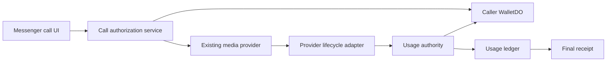

# Messenger 1:1 Call Billing Gate

**Status:** Implementation specification  
**Date:** 2026-08-24  
**Production state:** Dark; this specification authorizes no production flag change  
**Scope:** Messenger 1:1 human audio and video calls only

---

## 1. Product decision

Messenger calling is gated by media type:

- **Audio:** four free wall-clock hours per payer account per UTC day for an ordinary two-person Messenger call. Free audio uses Cloudflare. After exhaustion, any paid audio call is a new GetStream call funded in wallet tokens.
- **Video:** paid from the first genuinely connected second.
- **Paid-call provider:** every paid Messenger call—audio or video—uses GetStream. Cloudflare must never carry paid Messenger time.
- **Payer:** the caller pays for every connected participant-minute in the 1:1 call.
- **Video quality:** SD, HD, 2K, and 4K are separately priced SKUs. The user must see the selected quality, hourly estimate, and payer before confirming.
- **Pricing:** paid-audio and video-quality rates are remote configuration values. No app rebuild is required to change them.
- **Transport:** authorization, usage, wallet, ledger, and receipt logic remain provider-neutral, while provider policy is server-enforced: free audio is Cloudflare; paid audio and all video are GetStream.

This decision supersedes the existing human-call implementation wherever it conflicts. In particular, the old shared 200-participant-minute UTC-month pool and the rule that each participant pays for their own seat do not apply to this Messenger gate.

---

## 2. Explicit non-goals

This phase does not gate or modify:

- group calls;
- live streaming or AvaLive;
- AvaConsult or paid 1:1 consultations;
- marketplace booking, order, event, or vendor-session billing;
- PSTN, AvaDial, receptionist, voicemail, translation, or AI voice calls;
- invisible in-session provider migration between Cloudflare and GetStream;
- platform-fee or vendor-revenue settlement.

Those surfaces must not call the new Messenger authorization API until their own specifications define payer, pricing, refunds, and platform fees.

---

## 3. Canonical units and definitions

### 3.1 Participant time

All enforcement uses integer **participant-seconds**.

```text
participant_seconds = connected_wall_seconds × connected_participant_count
```

For a normal 1:1 call with both people connected:

```text
1 wall-clock minute = 2 participant-minutes = 120 participant-seconds
```

Only the caller's allowance and wallet are charged. The callee is never charged by this Messenger contract.

### 3.2 Daily audio allowance

The advertised allowance is four hours of ordinary 1:1 audio conversation per UTC day. Internally:

```text
4 wall hours × 2 participants × 60 minutes × 60 seconds
= 28,800 participant-seconds
= 480 participant-minutes
```

The allowance period key is the UTC date `YYYY-MM-DD`. It resets at 00:00:00 UTC. Unused allowance does not roll over.

### 3.3 Genuinely connected

Time is billable only while both authenticated participants are admitted to the same media session and the provider adapter reports the session as connected.

The following are never billable:

- authorization and pricing screens;
- permission prompts;
- provider initialization;
- ringing, push delivery, declined, missed, busy, or unanswered time;
- reconnect grace while fewer than two participants are connected;
- time after either participant leaves;
- setup failures and calls that never reach two connected participants.

### 3.4 Quality SKU

The canonical values are:

```text
audio
video_sd
video_hd
video_2k
video_4k
```

Display labels do not define enforcement. The server-issued authorization fixes the SKU and maximum provider quality for the lifetime of its lease.

---

## 4. Architecture

Billing consists of four provider-neutral layers:

1. **Authorization:** decides whether the call may start, freezes payer/SKU/rate/version, and reserves required wallet runway.
2. **Provider adapter:** translates Cloudflare or GetStream lifecycle evidence into connected participant intervals.
3. **Usage authority:** serializes ticks, consumes allowance or wallet reservation, and prevents double charging.
4. **Ledger and receipt:** records immutable usage totals and produces the caller-visible final receipt.



Provider selection must not affect allowance math, prices, payer, receipts, or idempotency. It is nevertheless a strict admission rule: Cloudflare accepts free audio only, and GetStream accepts every paid call.

---

## 5. Remote configuration

Add these keys to `PlatformConfig`, `DEFAULTS`, numeric-key parsing, the Flutter `RemoteConfig` mirror, and config contract tests.

| Key | Type | Safe default | Meaning |
|---|---:|---:|---|
| `messengerCallBillingEnabled` | bool | `false` | Master gate. False means existing Messenger behavior and no new charge. |
| `messengerAudioFreeParticipantSecondsDaily` | int | `28800` | Daily caller allowance. |
| `messengerAudioPaidCentitokensPerParticipantMinute` | int | `0` | Audio overage price. Zero means paid continuation unavailable, never free. |
| `messengerVideoSdCentitokensPerParticipantMinute` | int | `0` | SD video price. |
| `messengerVideoHdCentitokensPerParticipantMinute` | int | `0` | HD video price. |
| `messengerVideo2kCentitokensPerParticipantMinute` | int | `0` | 2K video price. |
| `messengerVideo4kCentitokensPerParticipantMinute` | int | `0` | 4K video price. |
| `messengerCallReservationWallSeconds` | int | `300` | Initial/renewal wallet runway in wall seconds. |
| `messengerCallLowBalanceWarningWallSeconds` | int | `300` | Warning threshold derived at the authorized rate. |
| `messengerCallUsageTickSeconds` | int | `15` | Maximum connected-time tick size. |
| `messengerCallPriceVersion` | int | `1` | Version stored with consent, authorization, ledger, and receipt. |

Rates use integer centitokens per participant-minute. One token equals 100 centitokens. All intermediate calculations retain sub-token precision; wallet debits remain whole tokens using the existing prepaid remainder bucket pattern.

Validation rules:

- negative values are rejected;
- an enabled paid SKU with a zero rate is unavailable and returns a typed configuration error;
- 2K/4K remain unavailable unless the active provider can enforce their actual capture/send caps;
- a config read failure must never create an unexpected charge;
- an authorization keeps its rate and price version even if remote configuration changes mid-call.

The exact five rates are intentionally unspecified in this document.

---

## 6. Persistent records

Use `DB_WALLET` for queryable financial records and the payer's WalletDO for serialized allowance/reservation state.

### 6.1 `messenger_call_authorizations`

One row per call attempt:

```sql
CREATE TABLE messenger_call_authorizations (
  authorization_id TEXT PRIMARY KEY,
  call_id TEXT NOT NULL UNIQUE,
  payer_uid TEXT NOT NULL,
  callee_uid TEXT NOT NULL,
  media TEXT NOT NULL,
  quality_sku TEXT NOT NULL,
  provider TEXT NOT NULL,
  rate_centitokens_per_participant_minute INTEGER NOT NULL,
  price_version INTEGER NOT NULL,
  consent_id TEXT,
  allowance_day TEXT,
  status TEXT NOT NULL,
  reservation_ref TEXT,
  created_at INTEGER NOT NULL,
  expires_at INTEGER NOT NULL,
  connected_at INTEGER,
  ended_at INTEGER,
  terminal_reason TEXT
);
```

Allowed status transitions:

```text
pending_consent -> authorized -> connected -> ended
pending_consent -> refused
authorized -> expired | cancelled | failed
connected -> ended | funds_exhausted
```

Transitions use compare-and-set updates. Terminal rows never reopen.

### 6.2 `messenger_call_usage_ledger`

Append-only idempotent usage ticks:

```sql
CREATE TABLE messenger_call_usage_ledger (
  tick_id TEXT PRIMARY KEY,
  authorization_id TEXT NOT NULL,
  call_id TEXT NOT NULL,
  payer_uid TEXT NOT NULL,
  provider TEXT NOT NULL,
  quality_sku TEXT NOT NULL,
  interval_start_ms INTEGER NOT NULL,
  interval_end_ms INTEGER NOT NULL,
  participant_count INTEGER NOT NULL,
  participant_seconds INTEGER NOT NULL,
  free_participant_seconds INTEGER NOT NULL,
  paid_participant_seconds INTEGER NOT NULL,
  charged_centitoken_seconds INTEGER NOT NULL,
  tokens_funded INTEGER NOT NULL,
  price_version INTEGER NOT NULL,
  created_at INTEGER NOT NULL
);
```

`tick_id` must be deterministic:

```text
messenger-call:<authorization_id>:<interval_start_ms>:<interval_end_ms>:<generation>
```

Retries return the prior result and do not consume allowance or wallet twice.

### 6.3 WalletDO daily state

Replace the old monthly `human_call_usage.period=YYYY-MM` behavior for this lane with a Messenger-specific daily table keyed by UTC date:

```sql
CREATE TABLE messenger_audio_daily_usage (
  day TEXT PRIMARY KEY,
  participant_seconds INTEGER NOT NULL DEFAULT 0,
  updated_at INTEGER NOT NULL
);
```

Keep the existing remainder-credit concept, but scope it to the Messenger payer and authorized SKU/rate contract. Do not silently reuse the old global monthly human-call bucket.

### 6.4 Receipt summary

The finalizer creates one caller-visible `wallet_transactions` record for each charged call and one zero-cost call-history receipt for a fully free audio call. The summary includes:

- call ID and authorization ID;
- media and quality;
- connected wall duration;
- participant count and participant-minutes;
- free participant-minutes applied;
- paid participant-minutes;
- authorized rate and price version;
- tokens charged;
- ending reason and timestamp.

Never expose the callee UID or internal provider credentials in receipts.

---

## 7. Authorization API

Add a provider-neutral internal service and expose a Messenger endpoint:

```text
POST /api/messenger-calls/authorize
```

Request:

```json
{
  "callee_uid": "user_...",
  "media": "audio|video",
  "quality": "sd|hd|2k|4k",
  "attempt_id": "uuid",
  "consent_id": "uuid-or-null"
}
```

The caller identity, app build, environment, and account scope come from authenticated server context, never trusted request fields.

Successful response:

```json
{
  "approved": true,
  "authorization_id": "uuid",
  "call_id": "server-minted",
  "payer": "caller",
  "provider": "stream|cloudflare",
  "quality_sku": "video_hd",
  "rate_centitokens_per_participant_minute": 0,
  "price_version": 1,
  "free_participant_seconds_remaining": 28800,
  "reserved_tokens": 0,
  "authorization_expires_at": 0
}
```

Typed non-success responses:

- `consent_required`;
- `insufficient_balance`;
- `quality_unavailable`;
- `pricing_unavailable`;
- `billing_disabled`;
- `callee_unavailable`;
- existing identity/block/busy/admission failures.

The endpoint is idempotent on `(payer_uid, attempt_id)`. A replay returns the same call and authorization, not another reservation or ring.

Existing provider routes must call the same authorization service:

- Stream Messenger placement may proceed only with a valid authorization.
- Cloudflare Messenger placement may proceed only with a valid authorization.
- Provider webhooks, clients, or call IDs cannot change the payer, SKU, or rate after authorization.

No provider ring is created before admission, consent, and any required reservation succeed.

---

## 8. Consent contract

### 8.1 Video

Every video call requires consent before authorization. The confirmation sheet shows:

- `Video calls are paid`;
- SD/HD/2K/4K selection;
- rate per participant-hour;
- estimated cost for one hour with two participants;
- `You pay for both participants`;
- current spendable token balance;
- a clear `Start paid video call` action.

The estimate is:

```text
hourly_tokens = ceil(rate_centitokens_per_participant_minute
                     × 60 minutes
                     × 2 participants
                     / 100)
```

Consent produces a short-lived `consent_id` bound to payer, callee, SKU, rate, price version, and attempt ID. It cannot be replayed for another call or quality.

### 8.2 Audio

Audio starts without a payment prompt while enough daily allowance exists.

When authorization finds no free allowance, it returns `consent_required` with the paid-audio rate and estimate. The user must explicitly choose `Continue with paid GetStream audio` before GetStream is contacted.

For a call that consumes the last free seconds while connected:

1. warn at configured remaining thresholds;
2. do not debit paid tokens without prior paid-audio consent;
3. at zero allowance, end the call cleanly with `free_allowance_exhausted`;
4. show `Continue with paid GetStream audio`;
5. after confirmation, create a fresh attempt ID, authorization ID, server call ID, reservation, and GetStream audio session.

The free Cloudflare call and paid GetStream call are separate sessions. Consent from the ended free call is transferred only through a short-lived server challenge bound to the same caller, callee, paid-audio SKU, GetStream provider, exact rate, and price version. This phase does not pause media indefinitely, reuse the Cloudflare call/attempt ID, or silently convert a free call into a paid call.

### 8.3 Quality changes

- Downshifts are allowed without new consent and retain the authorized ceiling/rate unless a future pricing policy says otherwise.
- Upgrades require a new consent bound to the higher SKU and a server authorization amendment before the provider changes quality.
- Failed upgrades leave the current call and price unchanged.

---

## 9. Reservation and charging

### 9.1 Caller-funded model

The caller is the sole payer. A connected two-person tick charges:

```text
tick_participant_seconds = tick_wall_seconds × 2
```

The callee's WalletDO is never called by this Messenger contract.

### 9.2 Initial reservation

Before a paid call rings, reserve enough paid-token headroom for `messengerCallReservationWallSeconds` at the selected rate and two participants. Use the existing WalletDO reservation primitives with:

```text
ref = messenger-call:<authorization_id>
allow_free = false
```

Free/bonus tokens may be allowed only if the wallet's product policy explicitly permits them. The implementation must choose and test one policy rather than inheriting an accidental default.

### 9.3 Renewal

The usage authority renews runway before the remaining reservation falls below the configured warning window. Reservation growth and tick consumption use deterministic operation IDs.

If renewal fails:

- send one low-balance/funds-exhausted state to the caller;
- stop admitting new paid time;
- end the media session cleanly;
- settle already connected time;
- release all unused reservation;
- never charge the callee.

### 9.4 Finalization

Every terminal path calls the same idempotent finalizer:

- normal hangup;
- remote hangup;
- insufficient funds;
- app kill/provider webhook termination;
- timeout/reaper after lost client callbacks;
- provider error.

Finalization consumes any last closed connected interval, releases unused reservation, writes the receipt summary, and marks the authorization terminal.

---

## 10. Connected-time adapters

Define a narrow provider-neutral interface:

```ts
interface MessengerCallLifecycleAdapter {
  participantConnected(uid: string, atMs: number, generation: string): Promise<void>;
  participantDisconnected(uid: string, atMs: number, generation: string): Promise<void>;
  qualityChanged(actual: QualitySku, atMs: number): Promise<void>;
  callEnded(reason: string, atMs: number): Promise<void>;
}
```

### 10.1 GetStream

GetStream is the only paid-call provider for Messenger audio and video. Extend the signed webhook handler to support the provider's participant-joined and participant-left/session lifecycle events. A call becomes billable only after the authenticated caller and callee are both joined. Provider webhook ID plus event timestamp/generation forms the dedupe key.

Client `join()` completion alone is not financial authority. Client telemetry may diagnose latency but cannot create billable time.

### 10.2 Cloudflare

Cloudflare is permitted only for free Messenger audio. Its authorization has rate `0`, carries no paid reservation, and ends at the allowance boundary. When Cloudflare Messenger media is used, CallRoom must combine authenticated participant identity with an explicit media-connected state. Two signaling WebSockets alone are insufficient because setup or reconnect sockets may exist without flowing media.

Cloudflare lifecycle events may consume the daily allowance but must never debit wallet tokens. Until two-sided media proof is implemented and tested, they must not consume allowance either.

### 10.3 Reconnects

- Close the connected interval when either participant disconnects.
- Reconnect grace may preserve the call UI but is non-billable.
- Open a fresh interval only after both authenticated participants are connected again.
- Generations prevent delayed leave events from closing a newer connection.

---

## 11. Server-enforced video quality

Each video SKU maps to a server-owned provider policy containing maximum dimensions, frame rate, and bitrate. Exact caps must be confirmed against the active GetStream account and SDK before implementation.

Required behavior:

- the authorization response contains only the SKU and public cap, never provider secrets;
- the provider call/session is created with the authorized maximum;
- the client requests no more than the cap;
- adaptive downshift is allowed for network health;
- adaptive downshift does not pretend the user received 2K/4K;
- telemetry records requested SKU and actual observed dimensions separately;
- 2K/4K buttons remain unavailable until end-to-end provider enforcement is proven on physical devices.

Marketing labels must describe real delivered ceilings. A locally upscaled or lower-resolution stream cannot be sold as 2K or 4K.

---

## 12. Client experience

### 12.1 Audio call button

Before ringing, fetch authorization. The UI may show the remaining free time without blocking the tap. If paid consent is required, show the confirmation sheet and call authorize again with the resulting consent ID.

### 12.2 Video call button

Open the quality-and-price sheet before any provider work. Disable SKUs whose remote price is zero/unavailable or whose provider cap is not supported.

### 12.3 In-call states

The existing call screen adds:

- free-audio time remaining when under 15 minutes;
- `Paid audio` or selected video quality indicator;
- low-balance warning with estimated remaining wall time;
- precise terminal explanation for allowance or funds exhaustion.

Do not show a countdown during ordinary free use. Do not interrupt calls for transient telemetry or receipt failures.

### 12.4 Final receipt

After termination, call history exposes a receipt/details entry. A paid receipt shows rate, participant-minutes, free portion if any, and tokens charged. A fully free audio receipt shows `0 tokens` and the allowance consumed.

---

## 13. Telemetry

Every event includes `call_id`, `authorization_id`, `attempt_id`, payer account ID, payer email when available, app build, environment, provider, media, quality SKU, price version, and role. Never emit provider tokens, secrets, raw authorization tokens, or full wallet objects.

Required events:

| Event | When |
|---|---|
| `messenger_call_authorization_requested` | Authenticated request begins. |
| `messenger_call_authorization_result` | Approved/refused with typed reason. |
| `messenger_call_consent_shown` | Price sheet displayed. |
| `messenger_call_consent_result` | Accepted/cancelled and selected SKU. |
| `messenger_call_reservation_result` | Initial or renewal reservation result. |
| `messenger_call_connected` | First billable interval opens. |
| `messenger_call_usage_tick` | Aggregated tick; includes free/paid participant-seconds. |
| `messenger_call_quality_observed` | Requested SKU and actual dimensions/bitrate summary. |
| `messenger_call_low_balance` | Warning emitted. |
| `messenger_call_funds_exhausted` | Paid time cannot continue. |
| `messenger_call_settlement_result` | Final charged/free totals and result. |
| `messenger_call_receipt_created` | Receipt summary persisted. |

Financial truth comes from WalletDO and ledger records, not PostHog. Telemetry is diagnostic and may be dropped without changing billing.

Alerts:

- authorized calls with no terminal state after the reaper window;
- connected provider intervals without usage ticks;
- duplicate ticks rejected;
- negative/overlapping intervals;
- receipt totals that do not reconcile with ticks;
- observed video quality above its cap;
- paid charges without a matching consent ID;
- any debit against the callee.

---

## 14. Idempotency, failures, and invariants

Mandatory invariants:

1. No provider ring before authorization.
2. No video authorization without matching consent.
3. No paid-audio debit without matching consent.
4. No billable time before two authenticated media participants are connected.
5. No billing during reconnect gaps.
6. Caller is the only payer.
7. A usage interval is charged at most once.
8. A config outage cannot invent a price or charge.
9. A rate change cannot alter an existing authorization.
10. Unused reservation is released on every terminal path or by a bounded reaper.
11. Tick totals reconcile exactly with the final receipt.
12. Master flag false preserves current Messenger behavior.

Fail closed for paid admission; fail safe against charging. If financial state is ambiguous, do not ring a new paid call and do not guess a debit.

---

## 15. Migration from the existing dark human-call meter

The repository already contains `humanCallParticipantBillingEnabled`, `human_call_usage`, `human_call_credit`, and per-seat CallRoom billing. They implement a different product:

- 200 participant-minutes per UTC month;
- allowance shared across audio and video;
- each participant pays their own usage;
- video has one rate rather than SD/HD/2K/4K;
- Stream lifecycle is not the financial authority.

Do not activate that flag for this launch.

Implementation choices:

- retain the old code dark until the new Messenger gate passes production observation, then delete it; or
- refactor its pure integer/remainder math and WalletDO serialization into the new daily caller-funded contract.

In either case, do not reinterpret existing monthly rows as daily allowance and do not migrate old participant usage into the new day. The launch starts a fresh daily Messenger allowance.

---

## 16. Test plan

### 16.1 Pure/unit tests

- 28,800 participant-seconds equals four wall hours for two participants;
- day boundary resets at UTC midnight;
- audio tick straddling the free/paid boundary;
- no consent means paid boundary stops without debit;
- video is paid from participant-second one;
- caller pays both seats; callee pays zero;
- centitoken rounding and remainder carry;
- rate frozen across config changes;
- idempotent authorization, tick, reservation, finalization, and receipt;
- overlapping/reordered provider events;
- reconnect gaps excluded;
- quality upgrade requires new consent;
- zero-rate paid SKU is unavailable;
- reservation failure produces no ring;
- receipt reconciliation.

### 16.2 Worker contract tests

- authentication and account scoping;
- admission/block/busy rules still execute;
- Stream place route cannot bypass authorization;
- signed Stream participant lifecycle opens/closes intervals once;
- forged client connected events cannot charge;
- call reaper closes orphaned intervals and releases reservation;
- master flag false produces no new wallet operations;
- callee wallet is never touched.

### 16.3 Flutter tests

- audio free path shows no payment sheet;
- exhausted audio shows explicit paid GetStream consent;
- accepting continuation creates fresh attempt/authorization/call IDs and never reuses the Cloudflare session;
- video always shows quality/price consent;
- cancel consent performs no provider work;
- unavailable SKU is disabled with explanation;
- low-balance and exhaustion states render correctly;
- call history opens the final receipt;
- account switching cannot reuse another account's consent or cached allowance.

All local consent/cache keys must use the existing per-account storage helpers.

---

## 17. Two-physical-account release gate

No production activation occurs until two physical phones using two distinct accounts pass all scenarios in staging:

1. free audio connects; ringing/setup time remains zero;
2. hang up from caller and callee; receipt totals match connected time;
3. background/foreground and Wi-Fi/cellular reconnect gaps are not billed;
4. allowance boundary ends without charging when consent is absent;
5. paid-audio consent starts a separate GetStream call whose reservation renews, settles, and releases correctly;
6. paid audio with insufficient balance never rings;
7. SD and HD video obtain consent and bill from connected time only;
8. 2K/4K stay disabled until their real provider caps are proven;
9. quality downshift does not exceed the authorized price/cap;
10. killed-app and provider-ended calls finalize through webhook/reaper;
11. repeated/reordered webhook delivery does not double charge;
12. caller wallet and receipt reconcile; callee wallet is unchanged;
13. PostHog events contain provider/media/quality and no secret material;
14. master-flag rollback restores current behavior without a new build.

Evidence retained for the release decision:

- both account IDs and app builds;
- call/authorization IDs;
- provider lifecycle timestamps;
- usage-ledger tick totals;
- before/after wallet balances;
- final receipt;
- relevant PostHog event trace;
- screen recording of consent, connection, warning, and receipt UX.

---

## 18. Rollout

1. Land schema, config keys, WalletDO state, and telemetry with the master flag false.
2. Land authorization and provider adapters; verify existing calls remain unchanged while false.
3. Land consent, quality selection, warnings, and receipts.
4. Run automated tests in GitHub Actions.
5. Deploy code and migrations to staging only.
6. Set non-zero staging rates and enable the staging master flag for the two test accounts.
7. Complete the two-phone release gate and reconcile every charge.
8. Ship the compatible app build before changing production billing flags.
9. Obtain explicit production approval for migrations/deployments and each flag write.
10. Configure production rates, then enable a narrow allowlist/canary before broad activation.
11. Monitor authorization, connection, settlement, insufficient-balance, and reconciliation alerts.

Rollback is one production flag change: `messengerCallBillingEnabled=false`. Rollback stops new authorizations from charging. Already connected paid calls finalize using their frozen contracts so usage already incurred remains reconcilable.

---

## 19. Definition of done

The phase is complete only when:

- Messenger audio receives exactly 28,800 free participant-seconds per caller per UTC day;
- paid audio never starts or continues without explicit consent;
- video is paid from the first connected participant-second;
- SD/HD/2K/4K prices are remote-configurable and server-enforced;
- only genuinely connected two-participant intervals are metered;
- the caller pays all participant time and the callee pays nothing;
- reservations, renewals, insufficient-funds termination, and release are idempotent;
- every call produces a reconcilable final receipt;
- required telemetry exists with provider/media/quality fields;
- two physical accounts pass the full staging matrix;
- production remains dark until explicit approval.
